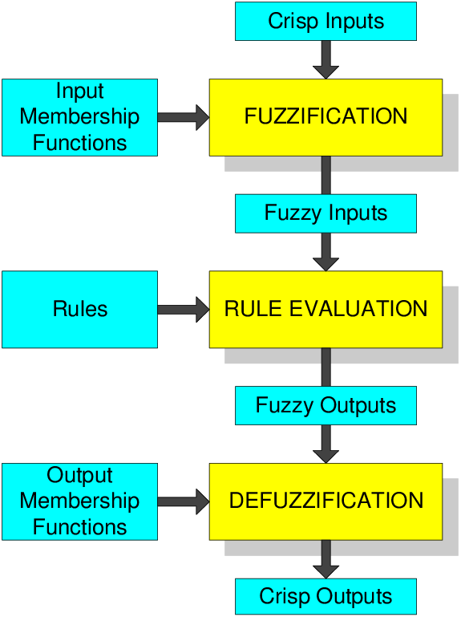

# Laporan Praktikum Fuzzy Logic
---
### Muhammad Farhan Arya Wicaksono
### 5054231011

prakltikum ini membahas implementasi dasar fungsi fuzzy menggunakan 

- `numpy`
- `skfuzzy` dari scikit-fuzzy untuk operasi logika fuzzy
- `matplotlib.pyplot` untuk memplot grafik


```python
import numpy as np
import skfuzzy as fuzz
from matplotlib import pyplot as plt
```

Contoh penggunaan `skfuzzy` untuk membuat fungsi membership `triangular`


```python

import numpy as np
import skfuzzy as fuzz
from matplotlib import pyplot as plt

# [0, 10]
x = np.arange(11)
mfx = fuzz.trimf(x, [0, 5, 10])

print(x)
print(mfx)

plt.title("Fuzzy Membership Function")
plt.plot(x, mfx)

```

    [ 0  1  2  3  4  5  6  7  8  9 10]
    [0.  0.2 0.4 0.6 0.8 1.  0.8 0.6 0.4 0.2 0. ]
    


    [<matplotlib.lines.Line2D at 0x18630556900>]


    

    


# Fuzzy Logic
---

Logika fuzzy adalah cara untuk memodelkan penalaran logis di mana kebenaran suatu pernyataan tidak bersifat biner (benar atau salah) seperti pada logika klasik. Sebaliknya, logika fuzzy memungkinkan nilai kebenaran berkisar dari 0hingga 1, 

Logika fuzzy memungkinkan  untuk merancang sistem inferensi fuzzy, yaitu fungsi yang memetakan sekumpulan input ke output menggunakan aturan yang mudah dipahami manusia

Misalnya, dalam sistem perbankan, logika ini dapat digunakan untuk menentukan risiko pemberian pinjaman berdasarkan informasi pribadi dan keuangan. Selain itu, logika fuzzy juga dapat digunakan dalam berbagai aplikasi lain, seperti mendeteksi tepi pada gambar.

Proses sistem inferensi fuzzy dimulai dengan fuzzifikasi, di mana nilai input yang jelas diubah menjadi variabel fuzzy. Kemudian, inferensi dilakukan dengan menerapkan aturan logika fuzzy untuk menghasilkan variabel fuzzy baru. Terakhir, defuzzifikasi mengubah nilai fuzzy kembali menjadi output yang jelas.




Sistem inferensi fuzzy memungkinkan komputer untuk meniru cara manusia memecahkan masalah, menggunakan pengetahuan berbasis pengalaman yang dikodekan dalam aturan logika. Ini membuat logika fuzzy sangat berguna, terutama dalam konteks di mana pemodelan matematis yang tepat sulit dilakukan.

Contoh operasi dasar dalam logika fuzzy,

 - negasi fuzzy (NOT)
 - konjungsi fuzzy (AND)
 - disjungsi fuzzy (OR)


```python
# [0, 10]
delta = 0.001
start = 0
stop = 10 + delta
step = 0.5
x = np.arange(start, stop + delta, step)

# Triangular membership function
x1 = np.arange(0, 5 + delta, step)
trimf = fuzz.trimf(x1, [0, 2.5, 5])

# Trapezoidal membership function
x2 = np.arange(4, 10 + delta, step)
trapmf = fuzz.trapmf(x2, [4, 6, 8, 10])

```

Fuzzy NOT: Menghitung komplemen dari fungsi keanggotaan segitiga dan trapezoidal, membalik nilai keanggotaan (tinggi menjadi rendah dan sebaliknya).

Fuzzy AND: Menghitung irisan dua himpunan fuzzy, mengembalikan nilai minimum di setiap titik, mencerminkan konjungsi logis di mana kedua fungsi tumpang tindih.

Fuzzy OR: Menghitung union dua himpunan fuzzy, mengembalikan nilai maksimum di setiap titik, menunjukkan disjungsi logis di mana keanggotaan tinggi dalam salah satu himpunan menghasilkan keanggotaan keseluruhan yang tingg


```python
# Fuzzy logic operations
tri_not = fuzz.fuzzy_not(trimf)
trap_not = fuzz.fuzzy_not(trapmf)
x3, tri_trap_and = fuzz.fuzzy_and(x1, trimf, x2, trapmf)
x3, tri_trap_or = fuzz.fuzzy_or(x1, trimf, x2, trapmf)
```

Menampilkan fungsi keanggotaan tringular dan trapezoid asli


```python
# Plot 1: Original membership functions
plt.figure(figsize=(8, 6))
plt.title("Fuzzy Logic - Original Membership Functions")
plt.plot(x1, trimf, label="Triangle", marker=".")
plt.plot(x2, trapmf, label="Trapezoidal", marker=".")
plt.legend(loc="upper right")
plt.xlabel("Input Value")
plt.ylabel("Membership Degree")
plt.grid()
plt.show()
```


    

    


Menampilkan hasil negasi fuzzy (Fuzzy NOT), menunjukkan nilai keanggotaan yang terbalik dari kedua fungsi


```python
# Plot 2: Fuzzy NOT operations
plt.figure(figsize=(8, 6))
plt.title("Fuzzy Logic - NOT Operations")
plt.plot(x1, tri_not, label="Fuzzy NOT Triangle", marker="x")
plt.plot(x2, trap_not, label="Fuzzy NOT Trapezoidal", marker="x")
plt.legend(loc="upper right")
plt.xlabel("Input Value")
plt.ylabel("Membership Degree")
plt.grid()
plt.show()

```


    

    


 Menunjukkan hasil dari operasi fuzzy AND dan OR,


```python
# Plot 3: Fuzzy AND and OR operations
plt.figure(figsize=(8, 6))
plt.title("Fuzzy Logic - AND and OR Operations")
plt.plot(x3, tri_trap_and, label="Fuzzy AND", marker="^")
plt.plot(x3, tri_trap_or, label="Fuzzy OR", marker="v")
plt.legend(loc="upper right")
plt.xlabel("Input Value")
plt.ylabel("Membership Degree")
plt.grid()
plt.show()

```


    

    


# Membership function


Membership Function dalam logika fuzzy memetakan nilai input ke derajat keanggotaan mereka, yang menggambarkan seberapa kuat mereka tergolong dalam suatu himpunan.

 (MF) dalam teori himpunan fuzzy adalah kurva yang mendefinisikan derajat keanggotaan untuk setiap titik dalam ruang input. Fungsi ini digunakan untuk memodelkan himpunan fuzzy berdasarkan data atau hipotesis fuzzy, dan dapat memiliki berbagai bentuk,


1. **Membership Function Segitiga (trimf)**
2. **Membership Function Trapezoidal (trapmf)**
3. **Membership Function Sigmoid (sigmf)**
4. **Fungsi S (smf)**
5. **Fungsi Z (zmf)**
6. **Fungsi Pi (pimf)**
7. **Membership Function Gaussian (gaussmf)**
8. **Fungsi Berbentuk Lonceng Umum (gbellmf)**


```python
import numpy as np
import matplotlib.pyplot as plt
import skfuzzy as fuzz

# Mendefinisikan rentang input
start = 0
stop = 10 + 0.001
step = 0.25
x = np.arange(start, stop, step)

# Fungsi keanggotaan
trimf = fuzz.trimf(x, [0, 5, 10])                # Triangular
trapmf = fuzz.trapmf(x, [0, 2, 8, 10])           # Trapezoidal
center = 5.0
width_control = 2.0
sigmf = fuzz.sigmf(x, center, width_control)     # Sigmoid
foot = 1.0
ceiling = 9.0
smf = fuzz.smf(x, foot, ceiling)                 # S-function
zmf = fuzz.zmf(x, foot, ceiling)                  # Z-function
pimf = fuzz.pimf(x, 0.0, 4.0, 5.0, 10.0)         # Pi-function
mean = 5.0
sigma = 1.25
gaussmf = fuzz.gaussmf(x, mean, sigma)           # Gaussian
width = 2.0
slope = 4.0
gbellmf = fuzz.gbellmf(x, width, slope, center)  # Generalized Bell-Shaped

fig_scale = 1.5
plt.figure(figsize=(6.4 * fig_scale, 4.8 * fig_scale))

# Mengatur subplot untuk 2x4
plt.subplot(2, 4, 1)
plt.plot(x, trimf, label="Triangular")
plt.title("Triangular MF")
plt.legend(loc="upper right")

plt.subplot(2, 4, 2)
plt.plot(x, trapmf, label="Trapezoidal")
plt.title("Trapezoidal MF")
plt.legend(loc="upper right")

plt.subplot(2, 4, 3)
plt.plot(x, sigmf, label="Sigmoid")
plt.title("Sigmoid MF")
plt.legend(loc="upper right")

plt.subplot(2, 4, 4)
plt.plot(x, smf, label="S-function")
plt.title("S-function")
plt.legend(loc="upper right")

plt.subplot(2, 4, 5)
plt.plot(x, zmf, label="Z-function")
plt.title("Z-function")
plt.legend(loc="upper right")

plt.subplot(2, 4, 6)
plt.plot(x, pimf, label="Pi-function")
plt.title("Pi-function")
plt.legend(loc="upper right")

plt.subplot(2, 4, 7)
plt.plot(x, gaussmf, label="Gaussian")
plt.title("Gaussian MF")
plt.legend(loc="upper right")

plt.subplot(2, 4, 8)
plt.plot(x, gbellmf, label="Bell-Shaped")
plt.title("Bell-Shaped MF")
plt.legend(loc="upper right")

# Menampilkan plot
plt.tight_layout()
plt.show()

```


    

    


# Defuzzification

Defuzzifikasi adalah proses invers dari fuzzifikasi, di mana pemetaan dilakukan untuk mengubah hasil fuzzy menjadi hasil yang jelas (crisp). Dalam konteks logika fuzzy, defuzzifikasi bertujuan untuk mengambil informasi yang telah diproses dalam bentuk fuzzy dan menghasilkan nilai tunggal yang dapat digunakan dalam pengambilan keputusan.


```python
import numpy as np
import skfuzzy as fuzz
from matplotlib import pyplot as plt

# [0, 10]
delta = 0.001
start = 0
stop = 10 + delta
step = 0.5
x = np.arange(start, stop + delta, step)

# Triangular membership function
x1 = np.arange(0, 5 + delta, step)
trimf = fuzz.trimf(x1, [0, 2.5, 5])

# Trapezoidal membership function
x2 = np.arange(4, 10 + delta, step)
trapmf = fuzz.trapmf(x2, [4, 6, 8, 10])

# fuzzy logic
tri_not = fuzz.fuzzy_not(trimf)
trap_not = fuzz.fuzzy_not(trapmf)
x3, tri_trap_and = fuzz.fuzzy_and(x1, trimf, x2, trapmf)
x3, tri_trap_or = fuzz.fuzzy_or(x1, trimf, x2, trapmf)

# Defuzzify
centroid_x = fuzz.defuzz(x3, tri_trap_or, "centroid")
centroid_y = fuzz.interp_membership(x3, tri_trap_or, centroid_x)
bisector_x = fuzz.defuzz(x3, tri_trap_or, "bisector")
bisector_y = fuzz.interp_membership(x3, tri_trap_or, bisector_x)
mom_x = fuzz.defuzz(x3, tri_trap_or, "mom")
mom_y = fuzz.interp_membership(x3, tri_trap_or, mom_x)
som_x = fuzz.defuzz(x3, tri_trap_or, "som")
som_y = fuzz.interp_membership(x3, tri_trap_or, som_x)
lom_x = fuzz.defuzz(x3, tri_trap_or, "lom")
lom_y = fuzz.interp_membership(x3, tri_trap_or, lom_x)

# Whole config
fig_scale = 1.5
plt.figure(figsize=(6.4 * fig_scale, 4.8 * fig_scale))
row = 4
col = 1

# plt.subplot(row, col, 1)
plt.title("Defuzzification")
plt.plot(x1, trimf, label="Triangle", marker=".")
plt.plot(x2, trapmf, label="Trapezoidal", marker=".")
plt.legend(loc="upper right")


# plt.subplot(row, col, 3)

```


    <matplotlib.legend.Legend at 0x18632cc35c0>


    

    


Menampilkan fungsi keanggotaan segitiga dan trapezoidal yang asli.


```python
plt.plot(x1, tri_not, label="Fuzzy NOT Triangle", marker="x")
plt.plot(x2, trap_not, label="Fuzzy NOT Trapezoidal", marker="x")
plt.plot(x3, tri_trap_and, label="Fuzzy AND", marker="^")
plt.plot(x3, tri_trap_or, label="Fuzzy OR", marker="v")
plt.legend(loc="upper right")
```


    <matplotlib.legend.Legend at 0x18632defe60>


    

    


Menyajikan hasil dari operasi fuzzy NOT, AND, dan OR.


```python
plt.plot(x3, tri_trap_or, label="Fuzzy OR", marker="v")
plt.vlines(centroid_x, 0.0, centroid_y, label="centroid", color="r")
plt.vlines(bisector_x, 0.0, bisector_y, label="bisector", color="b")
plt.vlines(mom_x, 0.0, mom_y, label="mom", color="g")
plt.vlines(som_x, 0.0, som_y, label="som", color="c")
plt.vlines(lom_x, 0.0, lom_y, label="lom", color="m")
plt.legend(loc="upper right")
```


    <matplotlib.legend.Legend at 0x1863307d4f0>


    

    


- centroid: Metode ini mencari titik di mana himpunan fuzzy seimbang, yang berfungsi sebagai titik "rata-rata" dari nilai fuzzy. centroid_x adalah koordinat x dari centroid, dan centroid_y adalah nilai keanggotaan di titik tersebut.

- Bisector: Metode ini membagi himpunan fuzzy menjadi dua area yang sama, mencari titik yang membagi himpunan fuzzy dengan cara yang sama. bisector_x adalah koordinat x dari bisector, dan bisector_y adalah nilai keanggotaan di titik tersebut.

- Mean of Maximum (MOM): Metode ini mengambil rata-rata dari titik-titik yang memiliki nilai keanggotaan tertinggi. mom_x adalah koordinat x dari nilai rata-rata maksimum, dan mom_y adalah nilai keanggotaan di titik tersebut.

- Smallest of Maximum (SOM): Metode ini memilih nilai x terkecil yang memiliki nilai keanggotaan maksimum. som_x adalah nilai x terkecil, dan som_y adalah nilai keanggotaan di titik tersebut.

- Largest of Maximum (LOM): Metode ini memilih nilai x terbesar yang memiliki nilai keanggotaan maksimum. lom_x adalah nilai x terbesar, dan lom_y adalah nilai keanggotaan di titik tersebut.

# The Tipping Problem
---
Salah satu contoh penerapan dari fuzzy logic, mencari tip yang sesuai dengan input variable nya

## Input Variabel
---
- Quality (kualitas)
- Service (servis)
## Ouput
---
Jumlah tip : persentase dari total bill

## generate User Variable


## Generate universe variables
* Quality and service on subjective ranges [0, 10]
* Tip has a range of [0, 25] in units of percentage points


```python
x_qual = np.arange(0, 11, 1)
x_serv = np.arange(0, 11, 1)
x_tip  = np.arange(0, 26, 1)
```

Membuat fuzzy Membership function


```python
qual_lo = fuzz.trimf(x_qual, [0, 0, 5])
qual_md = fuzz.trimf(x_qual, [0, 5, 10])
qual_hi = fuzz.trimf(x_qual, [5, 10, 10])
serv_lo = fuzz.trimf(x_serv, [0, 0, 5])
serv_md = fuzz.trimf(x_serv, [0, 5, 10])
serv_hi = fuzz.trimf(x_serv, [5, 10, 10])
tip_lo = fuzz.trimf(x_tip, [0, 0, 13])
tip_md = fuzz.trimf(x_tip, [0, 13, 25])
tip_hi = fuzz.trimf(x_tip, [13, 25, 25])
```

## Food Quality


```python
# Plot for Food quality
fig0, ax0 = plt.subplots(figsize=(8, 3))
ax0.plot(x_qual, qual_lo, 'b', linewidth=1.5, label='Bad')
ax0.plot(x_qual, qual_md, 'g', linewidth=1.5, label='Decent')
ax0.plot(x_qual, qual_hi, 'r', linewidth=1.5, label='Great')
ax0.set_title('Food quality')
ax0.legend()
ax0.spines['top'].set_visible(False)
ax0.spines['right'].set_visible(False)
ax0.get_xaxis().tick_bottom()
ax0.get_yaxis().tick_left()
plt.tight_layout()
plt.show()
```


    

    


## Service Quality


```python
# Plot for Service quality
fig1, ax1 = plt.subplots(figsize=(8, 3))
ax1.plot(x_serv, serv_lo, 'b', linewidth=1.5, label='Poor')
ax1.plot(x_serv, serv_md, 'g', linewidth=1.5, label='Acceptable')
ax1.plot(x_serv, serv_hi, 'r', linewidth=1.5, label='Amazing')
ax1.set_title('Service quality')
ax1.legend()
ax1.spines['top'].set_visible(False)
ax1.spines['right'].set_visible(False)
ax1.get_xaxis().tick_bottom()
ax1.get_yaxis().tick_left()
plt.tight_layout()
plt.show()
```


    

    


## Jumlah Tip


```python
# Plot for Tip amount
fig2, ax2 = plt.subplots(figsize=(8, 3))
ax2.plot(x_tip, tip_lo, 'b', linewidth=1.5, label='Low')
ax2.plot(x_tip, tip_md, 'g', linewidth=1.5, label='Medium')
ax2.plot(x_tip, tip_hi, 'r', linewidth=1.5, label='High')
ax2.set_title('Tip amount')
ax2.legend()
ax2.spines['top'].set_visible(False)
ax2.spines['right'].set_visible(False)
ax2.get_xaxis().tick_bottom()
ax2.get_yaxis().tick_left()
plt.tight_layout()
plt.show()
```


    

    


## Aturan Fuzzy

- If the food is bad OR the service is poor, then the tip will be low
- If the service is acceptable, then the tip will be medium
- If the food is great OR the service is amazing, then the tip will be high.

## Rule application

- Food quality was 6.5 Service was 9.8

Maka --->
- rule 1 : If the food is bad OR the service is poor, then the tip will be low
  - low  = max(bad, poor)
  - low  = max(0, 0)
  - low = 0
  
- rule 2 : If the service is acceptable, then the tip will be medium
  - medium = accpetable
  - medium = 0.039
  
- rule 3 : If the food is great OR the service is amazing, then the tip will be high.
  - high = max(great, amazing)
  - high = max(2.3, 0.9)
  - high = 0.96


```python

# We need the activation of our fuzzy membership functions at these values.
# The exact values 6.5 and 9.8 do not exist on our universes...
# This is what fuzz.interp_membership exists for!
qual_level_lo = fuzz.interp_membership(x_qual, qual_lo, 6.5)
qual_level_md = fuzz.interp_membership(x_qual, qual_md, 6.5)
qual_level_hi = fuzz.interp_membership(x_qual, qual_hi, 6.5)

serv_level_lo = fuzz.interp_membership(x_serv, serv_lo, 9.8)
serv_level_md = fuzz.interp_membership(x_serv, serv_md, 9.8)
serv_level_hi = fuzz.interp_membership(x_serv, serv_hi, 9.8)

# Now we take our rules and apply them. Rule 1 concerns bad food OR service.
# The OR operator means we take the maximum of these two.
active_rule1 = np.fmax(qual_level_lo, serv_level_lo)

# Now we apply this by clipping the top off the corresponding output
# membership function with `np.fmin`
tip_activation_lo = np.fmin(active_rule1, tip_lo)  # removed entirely to 0

# For rule 2 we connect acceptable service to medium tipping
tip_activation_md = np.fmin(serv_level_md, tip_md)

# For rule 3 we connect high service OR high food with high tipping
active_rule3 = np.fmax(qual_level_hi, serv_level_hi)
tip_activation_hi = np.fmin(active_rule3, tip_hi)
tip0 = np.zeros_like(x_tip)

# Visualize this
fig, ax0 = plt.subplots(figsize=(8, 3))

ax0.fill_between(x_tip, tip0, tip_activation_lo, facecolor='b', alpha=0.7)
ax0.plot(x_tip, tip_lo, 'b', linewidth=0.5, linestyle='--', )
ax0.fill_between(x_tip, tip0, tip_activation_md, facecolor='g', alpha=0.7)
ax0.plot(x_tip, tip_md, 'g', linewidth=0.5, linestyle='--')
ax0.fill_between(x_tip, tip0, tip_activation_hi, facecolor='r', alpha=0.7)
ax0.plot(x_tip, tip_hi, 'r', linewidth=0.5, linestyle='--')
ax0.set_title('Output membership activity')

print('Rule 1:', active_rule1)
print('Rule 2:', serv_level_md)
print('Rule 3:', active_rule3)

# Turn off top/right axes
for ax in (ax0,):
    ax.spines['top'].set_visible(False)
    ax.spines['right'].set_visible(False)
    ax.get_xaxis().tick_bottom()
    ax.get_yaxis().tick_left()

plt.tight_layout()


```

    Rule 1: 0.0
    Rule 2: 0.03999999999999987
    Rule 3: 0.9600000000000002
    


    

    


## Rule aggregation
---
Setelah kita tahu aktivitas dari setiap fungsi keanggotaan output, langkah selanjutnya adalah menggabungkan semua fungsi keanggotaan tersebut. Biasanya, ini dilakukan dengan menggunakan operator maksimum. Proses ini sering disebut sebagai agregasi.

## Defuzzifikasi

Terakhir, untuk mendapatkan jawaban yang konkret,  kembali dari logika fuzzy ke logika yang lebih jelas(crisp). Dalam contoh ini akan menggunakan metode centroid.

Hasilnya adalah tip sebesar 20,2%.


```python
# Aggregate all three output membership functions together
aggregated = np.fmax(tip_activation_lo,
                     np.fmax(tip_activation_md, tip_activation_hi))

# Calculate defuzzified result
tip = fuzz.defuzz(x_tip, aggregated, 'centroid')
tip_activation = fuzz.interp_membership(x_tip, aggregated, tip)  # for plot

# Visualize this
fig, ax0 = plt.subplots(figsize=(8, 3))

ax0.plot(x_tip, tip_lo, 'b', linewidth=0.5, linestyle='--', )
ax0.plot(x_tip, tip_md, 'g', linewidth=0.5, linestyle='--')
ax0.plot(x_tip, tip_hi, 'r', linewidth=0.5, linestyle='--')
ax0.fill_between(x_tip, tip0, aggregated, facecolor='Orange', alpha=0.7)
ax0.plot([tip, tip], [0, tip_activation], 'k', linewidth=1.5, alpha=0.9)
ax0.set_title('Aggregated membership and result (line)')

# Turn off top/right axes
for ax in (ax0,):
    ax.spines['top'].set_visible(False)
    ax.spines['right'].set_visible(False)
    ax.get_xaxis().tick_bottom()
    ax.get_yaxis().tick_left()

plt.tight_layout()
```


    

    


```python

```
