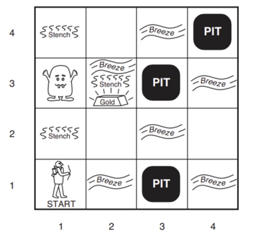

# Muhammad Farhan Arya Wicaksono (5054231011)
---


# 	Logical Agents

It is how AI approaches intelligence.
Knowledge-based agents can:
- accept new tasks in the form of explicitly described goals
- achieve competence quickly by being told or learning new knowledge about the environment
- adapt to changes in the environment by updating the relevant knowledge


```python
from logic import *
from utils import *
from notebook import psource
import pandas as pd
```

Buatlah program untuk masalah Wumpus World berdasarkan buku Artificial Intelligence: A Modern Approach pada halaman 238.



- Buatlah beberapa proposisi (aturan) R1 hingga Rn secara berurutan dan bertahap berdasarkan aturan Wumpus World, dimulai dari koordinat agen [1,1] hingga agen berhasil mendapatkan emas di koordinat [2,3] dengan selamat.
 - Lakukan inferensi menggunakan entailments TT-entails (untuk mahasiswa dengan NRP ganjil).
 - Lakukan inferensi menggunakan Resolution (untuk mahasiswa dengan NRP genap). 
 
 Dalam laporan, tuliskan kode program dan analisis program tersebut, khususnya jelaskan mengapa hasilnya demikian dengan menggunakan logika matematika.


## The Wumpus World
- Goa yang memiliki banyak ruangan yang mana terhubung dengan lorong lorong
- Wumpus: Binatang buas yang memakan siapa pun yang masuk kedalam ruangannya
- wumpus dapat dibunuh oleh agent, tetapi agen hanya memiliki satu panah.
- Beberapa ruangan memeliki jurang yang mana jika sudah masuk tidak bisa keluar
- Goal = mencari gold

The Wumpus World: PEAS definition
---
Performance measure
- +1000: gold
- -1000: fall into a pit or being eaten by the W umpus
- -1: for each action taken
- -10: for using up the arrow
- The game ends either when the agent dies or when the agent climbs out of the cave.
---
Environment
- A 4 × 4 grid of rooms.
- The agent always starts in the square labeled [1,1], facing to the right.
- The locations of the gold and the wumpus are chosen randomly, with a uniform distribution, from the squares other than the start square.
- Each square other than the start can be a pit, with probability 0.2.
---
Actuators
- The agent can move Forward, TurnLeft by 90◦, or TurnRight by 90◦.
- The agent dies if it enters a square containing a pit or a live wumpus.
- If an agent tries to move forward and bumps into a wall, then the agent does not move.
- The action Grab is used to pick up the gold if it is in the same square as the agent.
- The action Shoot is used to fire an arrow in a straight line in the direction the agent is facing.
- The action Climb can be used to climb out of the cave, but only from square [1,1]
---
Sensors
- In the square containing the wumpus and in the directly (not diagonally) adjacent squares, the agent will perceive a Stench.
- In the squares directly adjacent to a pit, the agent will perceive a Breeze.
- In the square where the gold is, the agent will perceive a Glitter.
- When an agent walks into a wall, it will perceive a Bump.
- When the wumpus is killed, it emits a Scream that can be perceived anywhere in the cave.
- Percept example: [Stench, Breeze, None, None, None]

## Inference in Propositional Knowledge Base
- menghitung semua model yang mungkin di mana KB adalah benar  
- memeriksa apakah juga benar dalam model-model ini. 

membuat daftar simbol $n$ dalam `KB` dan menghitung model $2^{n}$ dengan cara yang lebih mendalam dan memeriksa kebenaran `KB` dan $\alpha$.

# Code

Pada pembuatan program ini membuat dengan referensi dari Aiman Python dengan beberapa tambahan 


```python
def variables(s):
    """Return a set of the variables in expression s.
    >>> variables(expr('F(x, x) & G(x, y) & H(y, z) & R(A, z, 2)')) == {x, y, z}
    True
    """
     # Mengembalikan sebuah set yang berisi variabel-variabel dalam ekspresi `s`.
    # Ekspresi `s` dianalisis dengan cara mengambil semua sub-ekspresi,
    # kemudian memeriksa apakah sub-ekspresi tersebut adalah sebuah variabel.
    return {x for x in subexpressions(s) if is_variable(x)}

```


```python
# Mengembalikan True jika ekspresi logika proposisional bernilai benar dalam model,
# dan False jika bernilai salah. Jika model tidak menentukan nilai untuk setiap proposisi 
# fungsi ini dapat mengembalikan None untuk menunjukkan 'tidak jelas';
# hal ini bisa terjadi bahkan ketika ekspresi tersebut adalah tautologi.

def pl_true(exp, model={}):
    """Return True if the propositional logic expression is true in the model,
    and False if it is false. If the model does not specify the value for
    every proposition, this may return None to indicate 'not obvious';
    this may happen even when the expression is tautological.
    >>> pl_true(P, {}) is None
    True
    """
    if exp in (True, False):
        return exp
    op, args = exp.op, exp.args
    if is_prop_symbol(op):
        return model.get(exp)
    elif op == '~':
        p = pl_true(args[0], model)
        if p is None:
            return None
        else:
            return not p
    elif op == '|':
        result = False
        for arg in args:
            p = pl_true(arg, model)
            if p is True:
                return True
            if p is None:
                result = None
        return result
    elif op == '&':
        result = True
        for arg in args:
            p = pl_true(arg, model)
            if p is False:
                return False
            if p is None:
                result = None
        return result
    p, q = args
    if op == '==>':
        return pl_true(~p | q, model)
    elif op == '<==':
        return pl_true(p | ~q, model)
    pt = pl_true(p, model)
    if pt is None:
        return None
    qt = pl_true(q, model)
    if qt is None:
        return None
    if op == '<=>':
        return pt == qt
    elif op == '^':  # xor or 'not equivalent'
        return pt != qt
    else:
        raise ValueError('Illegal operator in logic expression' + str(exp))
```


```python
def tt_check_all_edit(kb, alpha, symbols, model, results_list):
    """Auxiliary routine to implement tt_entails."""
    if not symbols:
#         Mengembalikan True jika ekspresi logika proposisional bernilai benar dalam model sesuai dengan KB
        if pl_true(kb, model):
            result = pl_true(alpha, model)
            assert result in (True, False)
            
            model['kb'] = True
            results_list.append(model)  
            return result
        else:
            result_info = f"KB false, Model: {model}"
            model['kb'] = False
            results_list.append(model) 
            return True 
        
        
    else:
        P, rest = symbols[0], symbols[1:]
        
        true_result= tt_check_all_edit(kb, alpha, rest, extend(model, P, True), results_list)
        false_result= tt_check_all_edit(kb, alpha, rest, extend(model, P, False), results_list)
        
        return (true_result and false_result)
```


```python
def tt_entails_edit(kb, alpha):
    """
    Does kb entail the sentence alpha? Use truth tables. For propositional
    kb's and sentences. Note that the 'kb' should be an Expr which is a
    conjunction of clauses.
    """
    # Mengembalikan sebuah set yang berisi variabel-varible dalam ekspresi
    assert not variables(alpha)
    
    # Mengambil semua simbol proposisional (variabel) dari KB dan kalimat alpha
    symbols = list(prop_symbols(kb & alpha))
    
    print(f"Symbols: {symbols}")
    print(f"KB: {kb}\n")
    print(f"Alpha: {alpha}")
    print('-' * 20)
    
    # Menyimpan semua hasil truth table yang mungkin
    results_list = []
    
     # Memanggil fungsi tt_check_all untuk memeriksa apakah kb mengimplikasikan alpha.
    # Fungsi ini akan memeriksa setiap penugasan kebenaran untuk simbol-simbol tersebut,
    # memastikan bahwa jika kb benar, maka alpha juga harus benar.
    # {} adalah model awal yang kosong, tanpa penugasan variabel.
    hasil = tt_check_all_edit(kb, alpha, symbols, {}, results_list)
    
    print(f"Final result: {hasil}")

    return hasil, results_list  

```

Algoritma ini pada dasarnya memeriksa kebenaran setiap baris tabel kebenaran untuk pernyataan KB⟹α

Algoritma membuat semua kombinasi nilai kebenaran yang mungkin untuk simbol-simbol yang ada. Untuk setiap kombinasi (model), ia memeriksa apakah model tersebut konsisten dengan KB. Jika konsisten, algoritma memeriksa apakah query (αlpha) juga benar untuk model tersebut.

Fungsi tt_entails() mengambil simbol-simbol dari query dan memanggil tt_check_all() dengan parameter yang sesuai.

# tahapan

## KB bernilai benar jika $R_1$ hingga $R_n$ bernilai benar

- $P_x,_y$ is true if there is a pit in [x, y].
- $W_x,_y$ is true if there is a wumpus in [x, y], dead or alive.
- $B_x,_y$ is true if the agent perceives a breeze in [x, y].
- $S_x,_y$ is true if the agent perceives a stench in [x, y].
-  $G_x,_y$ is true if the agent perceives a gold in [x, y].

|    | 1    | 2    | 3   | 4   | 5 |
| ---- | ------- | ------- | ------ | ------ | ---- |
|  |      |       |      |      |    |
| 4|      |      |      |      |    |
| 3 |   |      |     |      |    |
| 2 |  ok|  |     |     |    |
| 1 | (A,ok) |  ok|  |  |   |

[1,1] aman tidak ada apa apa

## Agent ke [2,1]

|    | 1    | 2    | 3   | 4   | 5 |
| ---- | ------- | ------- | ------ | ------ | ---- |
|  |      |       |      |      |    |
| 4|      |      |      |      |    |
| 3 |   |      |     |      |    |
| 2 |  ok|  P?|     |     |    |
| 1 | V |  (A,B)| P? |  |   |

- Terdapat breeze di [2,1]
- jika dan hanya jika terdapat breeze di [2,1] maka ada pit di [1,1] atau [2,2] atau [3,1]
- $R_1$ = $B_{2,1}$ <=> $P_{1,1}$ $\lor$ $P_{2,2}$ $\lor$ $P_{3,1}$
---
- dan kita tahu juga bahwa tidak ada pit di [1,1]

- $R_2$ = ~$P_{1,1}$
---

- Ada Breeze di [1,2]
- $R_3$ = ~$B_{1,2}$


```python
P11, B21, P22, P31 = expr('P11, B21, P22, P31')
```


```python
R1 = (B21 |'<=>'| P11 | P22 |P31)
R1
```


    (((B21 <=> P11) | P22) | P31)


```python
R2 = ~ P11
R3 = B21
```

## check  Pit [2,2]
Saat agen berada di [2,1] apakah terdapat pit [2,2]

Call function TT-Entails 

mengubah hasil ke dalam Dataframe


```python
hasil_1 = pd.DataFrame(tt_entails_edit(R1 & R2 & R3, P22)[1])
hasil_1
```

    Symbols: [P11, B21, P22, P31]
    KB: (((((B21 <=> P11) | P22) | P31) & ~P11) & B21)
    
    Alpha: P22
    --------------------
    Final result: False
    


<div>
<style scoped>
    .dataframe tbody tr th:only-of-type {
        vertical-align: middle;
    }

    .dataframe tbody tr th {
        vertical-align: top;
    }

    .dataframe thead th {
        text-align: right;
    }
</style>
<table border="1" class="dataframe">
  <thead>
    <tr style="text-align: right;">
      <th></th>
      <th>P11</th>
      <th>B21</th>
      <th>P22</th>
      <th>P31</th>
      <th>kb</th>
    </tr>
  </thead>
  <tbody>
    <tr>
      <th>0</th>
      <td>True</td>
      <td>True</td>
      <td>True</td>
      <td>True</td>
      <td>False</td>
    </tr>
    <tr>
      <th>1</th>
      <td>True</td>
      <td>True</td>
      <td>True</td>
      <td>False</td>
      <td>False</td>
    </tr>
    <tr>
      <th>2</th>
      <td>True</td>
      <td>True</td>
      <td>False</td>
      <td>True</td>
      <td>False</td>
    </tr>
    <tr>
      <th>3</th>
      <td>True</td>
      <td>True</td>
      <td>False</td>
      <td>False</td>
      <td>False</td>
    </tr>
    <tr>
      <th>4</th>
      <td>True</td>
      <td>False</td>
      <td>True</td>
      <td>True</td>
      <td>False</td>
    </tr>
    <tr>
      <th>5</th>
      <td>True</td>
      <td>False</td>
      <td>True</td>
      <td>False</td>
      <td>False</td>
    </tr>
    <tr>
      <th>6</th>
      <td>True</td>
      <td>False</td>
      <td>False</td>
      <td>True</td>
      <td>False</td>
    </tr>
    <tr>
      <th>7</th>
      <td>True</td>
      <td>False</td>
      <td>False</td>
      <td>False</td>
      <td>False</td>
    </tr>
    <tr>
      <th>8</th>
      <td>False</td>
      <td>True</td>
      <td>True</td>
      <td>True</td>
      <td>True</td>
    </tr>
    <tr>
      <th>9</th>
      <td>False</td>
      <td>True</td>
      <td>True</td>
      <td>False</td>
      <td>True</td>
    </tr>
    <tr>
      <th>10</th>
      <td>False</td>
      <td>True</td>
      <td>False</td>
      <td>True</td>
      <td>True</td>
    </tr>
    <tr>
      <th>11</th>
      <td>False</td>
      <td>True</td>
      <td>False</td>
      <td>False</td>
      <td>False</td>
    </tr>
    <tr>
      <th>12</th>
      <td>False</td>
      <td>False</td>
      <td>True</td>
      <td>True</td>
      <td>False</td>
    </tr>
    <tr>
      <th>13</th>
      <td>False</td>
      <td>False</td>
      <td>True</td>
      <td>False</td>
      <td>False</td>
    </tr>
    <tr>
      <th>14</th>
      <td>False</td>
      <td>False</td>
      <td>False</td>
      <td>True</td>
      <td>False</td>
    </tr>
    <tr>
      <th>15</th>
      <td>False</td>
      <td>False</td>
      <td>False</td>
      <td>False</td>
      <td>False</td>
    </tr>
  </tbody>
</table>
</div>


Check dimana Kb bernilai benar


```python
hasil_1[hasil_1['kb'] == True]
```


<div>
<style scoped>
    .dataframe tbody tr th:only-of-type {
        vertical-align: middle;
    }

    .dataframe tbody tr th {
        vertical-align: top;
    }

    .dataframe thead th {
        text-align: right;
    }
</style>
<table border="1" class="dataframe">
  <thead>
    <tr style="text-align: right;">
      <th></th>
      <th>P11</th>
      <th>B21</th>
      <th>P22</th>
      <th>P31</th>
      <th>kb</th>
    </tr>
  </thead>
  <tbody>
    <tr>
      <th>8</th>
      <td>False</td>
      <td>True</td>
      <td>True</td>
      <td>True</td>
      <td>True</td>
    </tr>
    <tr>
      <th>9</th>
      <td>False</td>
      <td>True</td>
      <td>True</td>
      <td>False</td>
      <td>True</td>
    </tr>
    <tr>
      <th>10</th>
      <td>False</td>
      <td>True</td>
      <td>False</td>
      <td>True</td>
      <td>True</td>
    </tr>
  </tbody>
</table>
</div>


## Check  Pit [3,1]
Saat agen berada di [2,1] apakah terdapat pit [3,1]


```python
hasil_2 = pd.DataFrame(tt_entails_edit(R1 & R2 & R3, P31)[1])
hasil_2
```

    Symbols: [P11, B21, P22, P31]
    KB: (((((B21 <=> P11) | P22) | P31) & ~P11) & B21)
    
    Alpha: P31
    --------------------
    Final result: False
    


<div>
<style scoped>
    .dataframe tbody tr th:only-of-type {
        vertical-align: middle;
    }

    .dataframe tbody tr th {
        vertical-align: top;
    }

    .dataframe thead th {
        text-align: right;
    }
</style>
<table border="1" class="dataframe">
  <thead>
    <tr style="text-align: right;">
      <th></th>
      <th>P11</th>
      <th>B21</th>
      <th>P22</th>
      <th>P31</th>
      <th>kb</th>
    </tr>
  </thead>
  <tbody>
    <tr>
      <th>0</th>
      <td>True</td>
      <td>True</td>
      <td>True</td>
      <td>True</td>
      <td>False</td>
    </tr>
    <tr>
      <th>1</th>
      <td>True</td>
      <td>True</td>
      <td>True</td>
      <td>False</td>
      <td>False</td>
    </tr>
    <tr>
      <th>2</th>
      <td>True</td>
      <td>True</td>
      <td>False</td>
      <td>True</td>
      <td>False</td>
    </tr>
    <tr>
      <th>3</th>
      <td>True</td>
      <td>True</td>
      <td>False</td>
      <td>False</td>
      <td>False</td>
    </tr>
    <tr>
      <th>4</th>
      <td>True</td>
      <td>False</td>
      <td>True</td>
      <td>True</td>
      <td>False</td>
    </tr>
    <tr>
      <th>5</th>
      <td>True</td>
      <td>False</td>
      <td>True</td>
      <td>False</td>
      <td>False</td>
    </tr>
    <tr>
      <th>6</th>
      <td>True</td>
      <td>False</td>
      <td>False</td>
      <td>True</td>
      <td>False</td>
    </tr>
    <tr>
      <th>7</th>
      <td>True</td>
      <td>False</td>
      <td>False</td>
      <td>False</td>
      <td>False</td>
    </tr>
    <tr>
      <th>8</th>
      <td>False</td>
      <td>True</td>
      <td>True</td>
      <td>True</td>
      <td>True</td>
    </tr>
    <tr>
      <th>9</th>
      <td>False</td>
      <td>True</td>
      <td>True</td>
      <td>False</td>
      <td>True</td>
    </tr>
    <tr>
      <th>10</th>
      <td>False</td>
      <td>True</td>
      <td>False</td>
      <td>True</td>
      <td>True</td>
    </tr>
    <tr>
      <th>11</th>
      <td>False</td>
      <td>True</td>
      <td>False</td>
      <td>False</td>
      <td>False</td>
    </tr>
    <tr>
      <th>12</th>
      <td>False</td>
      <td>False</td>
      <td>True</td>
      <td>True</td>
      <td>False</td>
    </tr>
    <tr>
      <th>13</th>
      <td>False</td>
      <td>False</td>
      <td>True</td>
      <td>False</td>
      <td>False</td>
    </tr>
    <tr>
      <th>14</th>
      <td>False</td>
      <td>False</td>
      <td>False</td>
      <td>True</td>
      <td>False</td>
    </tr>
    <tr>
      <th>15</th>
      <td>False</td>
      <td>False</td>
      <td>False</td>
      <td>False</td>
      <td>False</td>
    </tr>
  </tbody>
</table>
</div>


```python
hasil_2[hasil_2['kb'] == True]
```


<div>
<style scoped>
    .dataframe tbody tr th:only-of-type {
        vertical-align: middle;
    }

    .dataframe tbody tr th {
        vertical-align: top;
    }

    .dataframe thead th {
        text-align: right;
    }
</style>
<table border="1" class="dataframe">
  <thead>
    <tr style="text-align: right;">
      <th></th>
      <th>P11</th>
      <th>B21</th>
      <th>P22</th>
      <th>P31</th>
      <th>kb</th>
    </tr>
  </thead>
  <tbody>
    <tr>
      <th>8</th>
      <td>False</td>
      <td>True</td>
      <td>True</td>
      <td>True</td>
      <td>True</td>
    </tr>
    <tr>
      <th>9</th>
      <td>False</td>
      <td>True</td>
      <td>True</td>
      <td>False</td>
      <td>True</td>
    </tr>
    <tr>
      <th>10</th>
      <td>False</td>
      <td>True</td>
      <td>False</td>
      <td>True</td>
      <td>True</td>
    </tr>
  </tbody>
</table>
</div>


## belum dapat diambil kesimpulan apakah benar pit di [3,1] atau [2,2] atau keduanya

## Maka Agent menuju ke [1,2]

|    | 1    | 2    | 3   | 4   | 5 |
| ---- | ------- | ------- | ------ | ------ | ---- |
|  |      |       |      |      |    |
| 4|      |      |      |      |    |
| 3 |  W? |      |     |      |    |
| 2 |  (A,S)|  ok|     |     |    |
| 1 | V |  v| P? |  |   |

- Mengapa pit [2,2] dikatakan ok  padahal sebelumnya diduga  ada pit di dalamnya?
- karena pada saat Agen di [1,2]  jika memang ada pit di [2,2] seharusnya pada saaat agent di [1,2] ia pasti akan menerima breeze juga dan seharusnya jika ada wumpus di [2,2] maka agent akan menerima stech di  [1,2]

- Terdapat stench di [1,2]
- jika dan hanya jika terdapat stench di [1,2] maka terdapat wumpus di [1,1] atau [2,2] atau [1,3]
- $R_4$ = $S_{1,2}$ <=> $W_{1,1}$ $\lor$ $W_{2,2}$ $\lor$ $W_{1,3}$
- $R_5$ = $S_{1,2}$
---
- dan kita tahu juga sudah mengunjungi [1,1] maka pasti tidak wumpus


- $R_6$ = ~$W_{1,1}$
---
- Bedasarkan hasil diatas Untuk di [2,2] sudah dipastikan tidak ada wumpus dan pit
- $R_7$ = ~$P_{2,2}$
- $R_8$ = ~$W_{2,2}$


```python
S12, W22, W13, W11, P13= expr('S12, W22, W13, W11, P13')

R4 = (S12 |'<=>'| W22 | W13 | W11)
```


```python
R5 = S12
```


```python
R6 = ~W11
```


```python
R7 = ~P22
```


```python
R8 = ~W22
```

## ketika sekarang di [1,2] agen mendapatkan informasi tambahan sehingga dapat menyimpulkan apakah?
- ada pit di [3,1], yang sebelumnya tidak dapat disimpulkan
- ada wumpus di [1,3]

## Check pit in [3,1] 
dengan Truth Table enumeration


```python
Check_31 = pd.DataFrame(tt_entails_edit(R1 & R2 & R3 & R4  & R5 & R6 & R7 & R8
                                        , P31)[1])
Check_31
```

    Symbols: [W22, P31, S12, W13, P22, B21, W11, P11]
    KB: ((((((((((B21 <=> P11) | P22) | P31) & ~P11) & B21) & (((S12 <=> W22) | W13) | W11)) & S12) & ~W11) & ~P22) & ~W22)
    
    Alpha: P31
    --------------------
    Final result: True
    


<div>
<style scoped>
    .dataframe tbody tr th:only-of-type {
        vertical-align: middle;
    }

    .dataframe tbody tr th {
        vertical-align: top;
    }

    .dataframe thead th {
        text-align: right;
    }
</style>
<table border="1" class="dataframe">
  <thead>
    <tr style="text-align: right;">
      <th></th>
      <th>W22</th>
      <th>P31</th>
      <th>S12</th>
      <th>W13</th>
      <th>P22</th>
      <th>B21</th>
      <th>W11</th>
      <th>P11</th>
      <th>kb</th>
    </tr>
  </thead>
  <tbody>
    <tr>
      <th>0</th>
      <td>True</td>
      <td>True</td>
      <td>True</td>
      <td>True</td>
      <td>True</td>
      <td>True</td>
      <td>True</td>
      <td>True</td>
      <td>False</td>
    </tr>
    <tr>
      <th>1</th>
      <td>True</td>
      <td>True</td>
      <td>True</td>
      <td>True</td>
      <td>True</td>
      <td>True</td>
      <td>True</td>
      <td>False</td>
      <td>False</td>
    </tr>
    <tr>
      <th>2</th>
      <td>True</td>
      <td>True</td>
      <td>True</td>
      <td>True</td>
      <td>True</td>
      <td>True</td>
      <td>False</td>
      <td>True</td>
      <td>False</td>
    </tr>
    <tr>
      <th>3</th>
      <td>True</td>
      <td>True</td>
      <td>True</td>
      <td>True</td>
      <td>True</td>
      <td>True</td>
      <td>False</td>
      <td>False</td>
      <td>False</td>
    </tr>
    <tr>
      <th>4</th>
      <td>True</td>
      <td>True</td>
      <td>True</td>
      <td>True</td>
      <td>True</td>
      <td>False</td>
      <td>True</td>
      <td>True</td>
      <td>False</td>
    </tr>
    <tr>
      <th>...</th>
      <td>...</td>
      <td>...</td>
      <td>...</td>
      <td>...</td>
      <td>...</td>
      <td>...</td>
      <td>...</td>
      <td>...</td>
      <td>...</td>
    </tr>
    <tr>
      <th>251</th>
      <td>False</td>
      <td>False</td>
      <td>False</td>
      <td>False</td>
      <td>False</td>
      <td>True</td>
      <td>False</td>
      <td>False</td>
      <td>False</td>
    </tr>
    <tr>
      <th>252</th>
      <td>False</td>
      <td>False</td>
      <td>False</td>
      <td>False</td>
      <td>False</td>
      <td>False</td>
      <td>True</td>
      <td>True</td>
      <td>False</td>
    </tr>
    <tr>
      <th>253</th>
      <td>False</td>
      <td>False</td>
      <td>False</td>
      <td>False</td>
      <td>False</td>
      <td>False</td>
      <td>True</td>
      <td>False</td>
      <td>False</td>
    </tr>
    <tr>
      <th>254</th>
      <td>False</td>
      <td>False</td>
      <td>False</td>
      <td>False</td>
      <td>False</td>
      <td>False</td>
      <td>False</td>
      <td>True</td>
      <td>False</td>
    </tr>
    <tr>
      <th>255</th>
      <td>False</td>
      <td>False</td>
      <td>False</td>
      <td>False</td>
      <td>False</td>
      <td>False</td>
      <td>False</td>
      <td>False</td>
      <td>False</td>
    </tr>
  </tbody>
</table>
<p>256 rows × 9 columns</p>
</div>


```python
# sudah dipaastikam bahwa [3,1] terdapat pit, karena tiap dari R bernilai benar
Check_31[Check_31['kb'] == True]
```


<div>
<style scoped>
    .dataframe tbody tr th:only-of-type {
        vertical-align: middle;
    }

    .dataframe tbody tr th {
        vertical-align: top;
    }

    .dataframe thead th {
        text-align: right;
    }
</style>
<table border="1" class="dataframe">
  <thead>
    <tr style="text-align: right;">
      <th></th>
      <th>W22</th>
      <th>P31</th>
      <th>S12</th>
      <th>W13</th>
      <th>P22</th>
      <th>B21</th>
      <th>W11</th>
      <th>P11</th>
      <th>kb</th>
    </tr>
  </thead>
  <tbody>
    <tr>
      <th>139</th>
      <td>False</td>
      <td>True</td>
      <td>True</td>
      <td>True</td>
      <td>False</td>
      <td>True</td>
      <td>False</td>
      <td>False</td>
      <td>True</td>
    </tr>
  </tbody>
</table>
</div>


Memenuhi semua  $R_1$ hingga $R_8$ sehingga bernilai benar, berdasarkan informasi yang sudah cukup bisa disimpulkan bahwa pada [3,1] terdapat pit

## Check wumpus [1,3]
dengan Truth Table enumeration


```python
Check_13 = pd.DataFrame(tt_entails_edit(R1 & R2 & R3 & R4  & R5 & R6 & R7 & R8
                                        , W13)[1])
Check_13
```

    Symbols: [W22, P31, S12, W13, P22, B21, W11, P11]
    KB: ((((((((((B21 <=> P11) | P22) | P31) & ~P11) & B21) & (((S12 <=> W22) | W13) | W11)) & S12) & ~W11) & ~P22) & ~W22)
    
    Alpha: W13
    --------------------
    Final result: True
    


<div>
<style scoped>
    .dataframe tbody tr th:only-of-type {
        vertical-align: middle;
    }

    .dataframe tbody tr th {
        vertical-align: top;
    }

    .dataframe thead th {
        text-align: right;
    }
</style>
<table border="1" class="dataframe">
  <thead>
    <tr style="text-align: right;">
      <th></th>
      <th>W22</th>
      <th>P31</th>
      <th>S12</th>
      <th>W13</th>
      <th>P22</th>
      <th>B21</th>
      <th>W11</th>
      <th>P11</th>
      <th>kb</th>
    </tr>
  </thead>
  <tbody>
    <tr>
      <th>0</th>
      <td>True</td>
      <td>True</td>
      <td>True</td>
      <td>True</td>
      <td>True</td>
      <td>True</td>
      <td>True</td>
      <td>True</td>
      <td>False</td>
    </tr>
    <tr>
      <th>1</th>
      <td>True</td>
      <td>True</td>
      <td>True</td>
      <td>True</td>
      <td>True</td>
      <td>True</td>
      <td>True</td>
      <td>False</td>
      <td>False</td>
    </tr>
    <tr>
      <th>2</th>
      <td>True</td>
      <td>True</td>
      <td>True</td>
      <td>True</td>
      <td>True</td>
      <td>True</td>
      <td>False</td>
      <td>True</td>
      <td>False</td>
    </tr>
    <tr>
      <th>3</th>
      <td>True</td>
      <td>True</td>
      <td>True</td>
      <td>True</td>
      <td>True</td>
      <td>True</td>
      <td>False</td>
      <td>False</td>
      <td>False</td>
    </tr>
    <tr>
      <th>4</th>
      <td>True</td>
      <td>True</td>
      <td>True</td>
      <td>True</td>
      <td>True</td>
      <td>False</td>
      <td>True</td>
      <td>True</td>
      <td>False</td>
    </tr>
    <tr>
      <th>...</th>
      <td>...</td>
      <td>...</td>
      <td>...</td>
      <td>...</td>
      <td>...</td>
      <td>...</td>
      <td>...</td>
      <td>...</td>
      <td>...</td>
    </tr>
    <tr>
      <th>251</th>
      <td>False</td>
      <td>False</td>
      <td>False</td>
      <td>False</td>
      <td>False</td>
      <td>True</td>
      <td>False</td>
      <td>False</td>
      <td>False</td>
    </tr>
    <tr>
      <th>252</th>
      <td>False</td>
      <td>False</td>
      <td>False</td>
      <td>False</td>
      <td>False</td>
      <td>False</td>
      <td>True</td>
      <td>True</td>
      <td>False</td>
    </tr>
    <tr>
      <th>253</th>
      <td>False</td>
      <td>False</td>
      <td>False</td>
      <td>False</td>
      <td>False</td>
      <td>False</td>
      <td>True</td>
      <td>False</td>
      <td>False</td>
    </tr>
    <tr>
      <th>254</th>
      <td>False</td>
      <td>False</td>
      <td>False</td>
      <td>False</td>
      <td>False</td>
      <td>False</td>
      <td>False</td>
      <td>True</td>
      <td>False</td>
    </tr>
    <tr>
      <th>255</th>
      <td>False</td>
      <td>False</td>
      <td>False</td>
      <td>False</td>
      <td>False</td>
      <td>False</td>
      <td>False</td>
      <td>False</td>
      <td>False</td>
    </tr>
  </tbody>
</table>
<p>256 rows × 9 columns</p>
</div>


```python
# sudah dipaastikam bahwa [1,3] terdapat wumpus
Check_13[Check_13['kb'] == True]
```


<div>
<style scoped>
    .dataframe tbody tr th:only-of-type {
        vertical-align: middle;
    }

    .dataframe tbody tr th {
        vertical-align: top;
    }

    .dataframe thead th {
        text-align: right;
    }
</style>
<table border="1" class="dataframe">
  <thead>
    <tr style="text-align: right;">
      <th></th>
      <th>W22</th>
      <th>P31</th>
      <th>S12</th>
      <th>W13</th>
      <th>P22</th>
      <th>B21</th>
      <th>W11</th>
      <th>P11</th>
      <th>kb</th>
    </tr>
  </thead>
  <tbody>
    <tr>
      <th>139</th>
      <td>False</td>
      <td>True</td>
      <td>True</td>
      <td>True</td>
      <td>False</td>
      <td>True</td>
      <td>False</td>
      <td>False</td>
      <td>True</td>
    </tr>
  </tbody>
</table>
</div>


Memenuhi semua  $R_1$ hingga $R_8$ sehingga bernilai benar, berdasarkan informasi yang sudah cukup bisa disimpulkan bahwa pada [1,3] terdapat wumpus

## dari hasil tersebut

- ada pit di [3,1]
- ada wumpus di [1,3]

---
- $R_9$ = $P_{3,1}$
- $R_{10}$ = $W_{1,3}$


```python
R9 = P31
R10 = W13
```

---

## Agent sekarang di [2,2]

|    | 1    | 2    | 3   | 4   | 5 |
| ---- | ------- | ------- | ------ | ------ | ---- |
|  |      |       |      |      |    |
| 4|      |      |      |      |    |
| 3 |  W |    ok  |     |      |    |
| 2 |  V|  A|   ok  |     |    |
| 1 | V |  V| P |  |   |


## tidak ada tanda tanda, agen berpindah ke [3,2]
---
Agent sekarang di [3,2]


|    | 1    | 2    | 3   | 4   | 5 |
| ---- | ------- | ------- | ------ | ------ | ---- |
|  |      |       |      |      |    |
| 4|      |      |      |      |    |
| 3 |  W |    ok  | P?    |      |    |
| 2 |  V|  V|   (A,b)  | P?    |    |
| 1 | V |  V| P |  |   |

- Terdapat Breeze di [3,2]
- jika dan hanya jika terdapat Breeze di [3,2] maka terdapat pit di [3,3] atau [4,2] atau [3,1]
- $R_{11}$ = $B_{3,2}$ <=> $W_{3,3}$ $\lor$ $W_{4,2}$ $\lor$ $P_{3,1}$
- $R_{12}$ = $B_{3,2}$


```python
B32, P33, P42 = expr('B32, P33, P42 ')
R11= (B32 |'<=>'| P33 | P42 )
R12 = B32
```

## Check apakah
- ada pit di [3,3]
- ada wumpus di [4,2]

## Check pit in [3,3]


```python
Check_33 = pd.DataFrame(tt_entails_edit(R1 & R2 & R3 & R4 & R5 & R6 & R7 & R8 & R9 & R10 & R11 & R12
                                        , P33)[1])
Check_33
```

    Symbols: [W22, P31, S12, W13, B32, P22, B21, W11, P11, P33, P42]
    KB: ((((((((((((((B21 <=> P11) | P22) | P31) & ~P11) & B21) & (((S12 <=> W22) | W13) | W11)) & S12) & ~W11) & ~P22) & ~W22) & P31) & W13) & ((B32 <=> P33) | P42)) & B32)
    
    Alpha: P33
    --------------------
    Final result: False
    


<div>
<style scoped>
    .dataframe tbody tr th:only-of-type {
        vertical-align: middle;
    }

    .dataframe tbody tr th {
        vertical-align: top;
    }

    .dataframe thead th {
        text-align: right;
    }
</style>
<table border="1" class="dataframe">
  <thead>
    <tr style="text-align: right;">
      <th></th>
      <th>W22</th>
      <th>P31</th>
      <th>S12</th>
      <th>W13</th>
      <th>B32</th>
      <th>P22</th>
      <th>B21</th>
      <th>W11</th>
      <th>P11</th>
      <th>P33</th>
      <th>P42</th>
      <th>kb</th>
    </tr>
  </thead>
  <tbody>
    <tr>
      <th>0</th>
      <td>True</td>
      <td>True</td>
      <td>True</td>
      <td>True</td>
      <td>True</td>
      <td>True</td>
      <td>True</td>
      <td>True</td>
      <td>True</td>
      <td>True</td>
      <td>True</td>
      <td>False</td>
    </tr>
    <tr>
      <th>1</th>
      <td>True</td>
      <td>True</td>
      <td>True</td>
      <td>True</td>
      <td>True</td>
      <td>True</td>
      <td>True</td>
      <td>True</td>
      <td>True</td>
      <td>True</td>
      <td>False</td>
      <td>False</td>
    </tr>
    <tr>
      <th>2</th>
      <td>True</td>
      <td>True</td>
      <td>True</td>
      <td>True</td>
      <td>True</td>
      <td>True</td>
      <td>True</td>
      <td>True</td>
      <td>True</td>
      <td>False</td>
      <td>True</td>
      <td>False</td>
    </tr>
    <tr>
      <th>3</th>
      <td>True</td>
      <td>True</td>
      <td>True</td>
      <td>True</td>
      <td>True</td>
      <td>True</td>
      <td>True</td>
      <td>True</td>
      <td>True</td>
      <td>False</td>
      <td>False</td>
      <td>False</td>
    </tr>
    <tr>
      <th>4</th>
      <td>True</td>
      <td>True</td>
      <td>True</td>
      <td>True</td>
      <td>True</td>
      <td>True</td>
      <td>True</td>
      <td>True</td>
      <td>False</td>
      <td>True</td>
      <td>True</td>
      <td>False</td>
    </tr>
    <tr>
      <th>...</th>
      <td>...</td>
      <td>...</td>
      <td>...</td>
      <td>...</td>
      <td>...</td>
      <td>...</td>
      <td>...</td>
      <td>...</td>
      <td>...</td>
      <td>...</td>
      <td>...</td>
      <td>...</td>
    </tr>
    <tr>
      <th>2043</th>
      <td>False</td>
      <td>False</td>
      <td>False</td>
      <td>False</td>
      <td>False</td>
      <td>False</td>
      <td>False</td>
      <td>False</td>
      <td>True</td>
      <td>False</td>
      <td>False</td>
      <td>False</td>
    </tr>
    <tr>
      <th>2044</th>
      <td>False</td>
      <td>False</td>
      <td>False</td>
      <td>False</td>
      <td>False</td>
      <td>False</td>
      <td>False</td>
      <td>False</td>
      <td>False</td>
      <td>True</td>
      <td>True</td>
      <td>False</td>
    </tr>
    <tr>
      <th>2045</th>
      <td>False</td>
      <td>False</td>
      <td>False</td>
      <td>False</td>
      <td>False</td>
      <td>False</td>
      <td>False</td>
      <td>False</td>
      <td>False</td>
      <td>True</td>
      <td>False</td>
      <td>False</td>
    </tr>
    <tr>
      <th>2046</th>
      <td>False</td>
      <td>False</td>
      <td>False</td>
      <td>False</td>
      <td>False</td>
      <td>False</td>
      <td>False</td>
      <td>False</td>
      <td>False</td>
      <td>False</td>
      <td>True</td>
      <td>False</td>
    </tr>
    <tr>
      <th>2047</th>
      <td>False</td>
      <td>False</td>
      <td>False</td>
      <td>False</td>
      <td>False</td>
      <td>False</td>
      <td>False</td>
      <td>False</td>
      <td>False</td>
      <td>False</td>
      <td>False</td>
      <td>False</td>
    </tr>
  </tbody>
</table>
<p>2048 rows × 12 columns</p>
</div>


 tidak dapat dismpulkan apakah ada pit [3,3]


```python
Check_33[Check_33['kb'] == True]
```


<div>
<style scoped>
    .dataframe tbody tr th:only-of-type {
        vertical-align: middle;
    }

    .dataframe tbody tr th {
        vertical-align: top;
    }

    .dataframe thead th {
        text-align: right;
    }
</style>
<table border="1" class="dataframe">
  <thead>
    <tr style="text-align: right;">
      <th></th>
      <th>W22</th>
      <th>P31</th>
      <th>S12</th>
      <th>W13</th>
      <th>B32</th>
      <th>P22</th>
      <th>B21</th>
      <th>W11</th>
      <th>P11</th>
      <th>P33</th>
      <th>P42</th>
      <th>kb</th>
    </tr>
  </thead>
  <tbody>
    <tr>
      <th>1068</th>
      <td>False</td>
      <td>True</td>
      <td>True</td>
      <td>True</td>
      <td>True</td>
      <td>False</td>
      <td>True</td>
      <td>False</td>
      <td>False</td>
      <td>True</td>
      <td>True</td>
      <td>True</td>
    </tr>
    <tr>
      <th>1069</th>
      <td>False</td>
      <td>True</td>
      <td>True</td>
      <td>True</td>
      <td>True</td>
      <td>False</td>
      <td>True</td>
      <td>False</td>
      <td>False</td>
      <td>True</td>
      <td>False</td>
      <td>True</td>
    </tr>
    <tr>
      <th>1070</th>
      <td>False</td>
      <td>True</td>
      <td>True</td>
      <td>True</td>
      <td>True</td>
      <td>False</td>
      <td>True</td>
      <td>False</td>
      <td>False</td>
      <td>False</td>
      <td>True</td>
      <td>True</td>
    </tr>
  </tbody>
</table>
</div>


## Check pit in [4,2]


```python
Check_42 = pd.DataFrame(tt_entails_edit(R1 & R2 & R3 & R4 & R5 & R6 & R7 & R8 & R9
                                        , P42)[1])
Check_42
```

    Symbols: [P31, W22, S12, W13, P22, B21, W11, P11, P42]
    KB: (((((((((((B21 <=> P11) | P22) | P31) & ~P11) & B21) & (((S12 <=> W22) | W13) | W11)) & S12) & ~W11) & ~P22) & ~W22) & P31)
    
    Alpha: P42
    --------------------
    Final result: False
    


<div>
<style scoped>
    .dataframe tbody tr th:only-of-type {
        vertical-align: middle;
    }

    .dataframe tbody tr th {
        vertical-align: top;
    }

    .dataframe thead th {
        text-align: right;
    }
</style>
<table border="1" class="dataframe">
  <thead>
    <tr style="text-align: right;">
      <th></th>
      <th>P31</th>
      <th>W22</th>
      <th>S12</th>
      <th>W13</th>
      <th>P22</th>
      <th>B21</th>
      <th>W11</th>
      <th>P11</th>
      <th>P42</th>
      <th>kb</th>
    </tr>
  </thead>
  <tbody>
    <tr>
      <th>0</th>
      <td>True</td>
      <td>True</td>
      <td>True</td>
      <td>True</td>
      <td>True</td>
      <td>True</td>
      <td>True</td>
      <td>True</td>
      <td>True</td>
      <td>False</td>
    </tr>
    <tr>
      <th>1</th>
      <td>True</td>
      <td>True</td>
      <td>True</td>
      <td>True</td>
      <td>True</td>
      <td>True</td>
      <td>True</td>
      <td>True</td>
      <td>False</td>
      <td>False</td>
    </tr>
    <tr>
      <th>2</th>
      <td>True</td>
      <td>True</td>
      <td>True</td>
      <td>True</td>
      <td>True</td>
      <td>True</td>
      <td>True</td>
      <td>False</td>
      <td>True</td>
      <td>False</td>
    </tr>
    <tr>
      <th>3</th>
      <td>True</td>
      <td>True</td>
      <td>True</td>
      <td>True</td>
      <td>True</td>
      <td>True</td>
      <td>True</td>
      <td>False</td>
      <td>False</td>
      <td>False</td>
    </tr>
    <tr>
      <th>4</th>
      <td>True</td>
      <td>True</td>
      <td>True</td>
      <td>True</td>
      <td>True</td>
      <td>True</td>
      <td>False</td>
      <td>True</td>
      <td>True</td>
      <td>False</td>
    </tr>
    <tr>
      <th>...</th>
      <td>...</td>
      <td>...</td>
      <td>...</td>
      <td>...</td>
      <td>...</td>
      <td>...</td>
      <td>...</td>
      <td>...</td>
      <td>...</td>
      <td>...</td>
    </tr>
    <tr>
      <th>507</th>
      <td>False</td>
      <td>False</td>
      <td>False</td>
      <td>False</td>
      <td>False</td>
      <td>False</td>
      <td>True</td>
      <td>False</td>
      <td>False</td>
      <td>False</td>
    </tr>
    <tr>
      <th>508</th>
      <td>False</td>
      <td>False</td>
      <td>False</td>
      <td>False</td>
      <td>False</td>
      <td>False</td>
      <td>False</td>
      <td>True</td>
      <td>True</td>
      <td>False</td>
    </tr>
    <tr>
      <th>509</th>
      <td>False</td>
      <td>False</td>
      <td>False</td>
      <td>False</td>
      <td>False</td>
      <td>False</td>
      <td>False</td>
      <td>True</td>
      <td>False</td>
      <td>False</td>
    </tr>
    <tr>
      <th>510</th>
      <td>False</td>
      <td>False</td>
      <td>False</td>
      <td>False</td>
      <td>False</td>
      <td>False</td>
      <td>False</td>
      <td>False</td>
      <td>True</td>
      <td>False</td>
    </tr>
    <tr>
      <th>511</th>
      <td>False</td>
      <td>False</td>
      <td>False</td>
      <td>False</td>
      <td>False</td>
      <td>False</td>
      <td>False</td>
      <td>False</td>
      <td>False</td>
      <td>False</td>
    </tr>
  </tbody>
</table>
<p>512 rows × 10 columns</p>
</div>


Tidak dapat disumpulkan tidak ada pit di  [4,2]


```python
Check_42[Check_42['kb'] == True]
```


<div>
<style scoped>
    .dataframe tbody tr th:only-of-type {
        vertical-align: middle;
    }

    .dataframe tbody tr th {
        vertical-align: top;
    }

    .dataframe thead th {
        text-align: right;
    }
</style>
<table border="1" class="dataframe">
  <thead>
    <tr style="text-align: right;">
      <th></th>
      <th>P31</th>
      <th>W22</th>
      <th>S12</th>
      <th>W13</th>
      <th>P22</th>
      <th>B21</th>
      <th>W11</th>
      <th>P11</th>
      <th>P42</th>
      <th>kb</th>
    </tr>
  </thead>
  <tbody>
    <tr>
      <th>150</th>
      <td>True</td>
      <td>False</td>
      <td>True</td>
      <td>True</td>
      <td>False</td>
      <td>True</td>
      <td>False</td>
      <td>False</td>
      <td>True</td>
      <td>True</td>
    </tr>
    <tr>
      <th>151</th>
      <td>True</td>
      <td>False</td>
      <td>True</td>
      <td>True</td>
      <td>False</td>
      <td>True</td>
      <td>False</td>
      <td>False</td>
      <td>False</td>
      <td>True</td>
    </tr>
  </tbody>
</table>
</div>


---
## Agent sekarang di [2,3]


|    | 1    | 2    | 3   | 4   | 5 |
| ---- | ------- | ------- | ------ | ------ | ---- |
|  |      |       |      |      |    |
| 4|      |      |      |      |    |
| 3 |  W |    (A,G) | P?    |      |    |
| 2 |  V|  V|  (V, B)  | P?    |    |
| 1 | V |  V| P |  |   |

 - Agent berhasil mendapatkan gold dan balik pulang
 - $R_{13}$ = $G_{2,3}$ 


```python


```


```python

```
