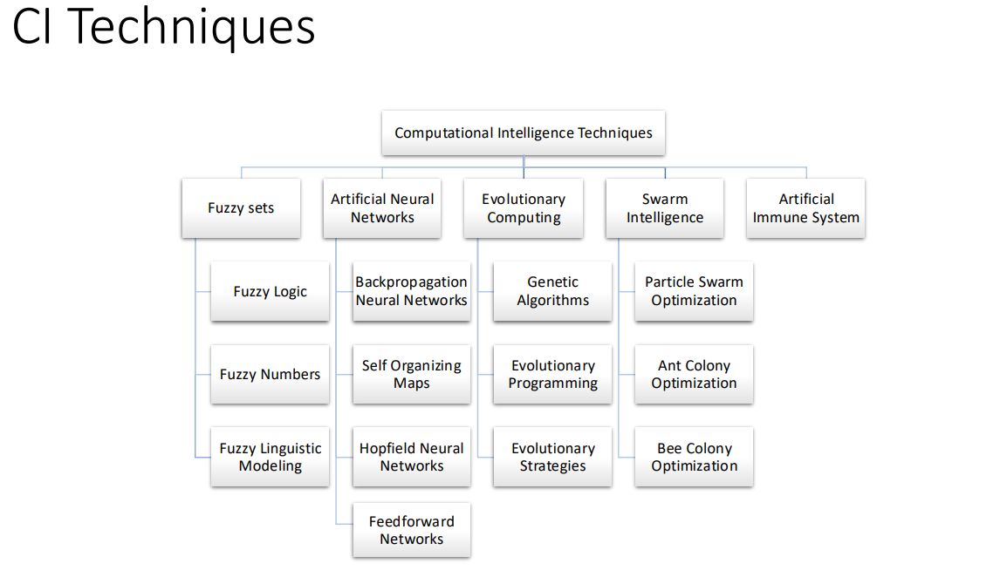

# Intro to Computational Intelligence

Courses: Computational Thinking (https://www.notion.so/Computational-Thinking-c5643931db634152a6f1bc096b37d5eb?pvs=21)  
Date: August 26, 2024

# What is Intelligence

Webster’s New Collegiate Dictionary defines intelligence as “1a(1) : The ability to learn or  
understand or to deal with new or trying situations : REASON; also: the skilled use of reason (2) : the  
ability to apply knowledge to manipulate one’s environment or to think abstractly as measured by objective criteria (as tests)”

| Discipline | Key Concepts | Contribution to Computational Thinking |
| --- | --- | --- |
| Philosophy | Logic, methods of reasoning, mind as physical system | Provides frameworks for logical thinking and problem-solving |
| Mathematics | Formal representation, algorithms, computation, probability | Offers tools for abstract problem representation and solution |
| Economics | Utility, decision theory | Introduces concepts for optimizing choices and outcomes |
| Neuroscience | Physical substrate for mental activity | Informs understanding of cognitive processes and information processing |
| Psychology | Perception, motor control, experimental techniques | Provides insights into human cognition and behavior modeling |
| Computer Science | Building fast computers | Develops tools and technologies for implementing computational solutions |
| Control Theory | Systems that maximize objective functions over time | Offers strategies for optimizing complex systems and processes |
| Linguistics | Knowledge representation, grammar | Contributes to natural language processing and information structuring |

# What is Computational Intelligence

Computational Intelligence (CI) is the theory, design, application and development of biologically and linguistically motivated computational paradigms. Traditionally the three main pillars of CI have been [Neural Networks](https://cis.ieee.org/publications/t-neural-networks-and-learning-systems), [Fuzzy Systems](https://cis.ieee.org/publications/t-fuzzy-systems) and [Evolutionary Computation](https://cis.ieee.org/publications/t-evolutionary-computation)

[https://cis.ieee.org/about/what-is-ci#:~:text=Computational Intelligence (CI) is the,Fuzzy Systems and Evolutionary Computation](https://cis.ieee.org/about/what-is-ci#:~:text=Computational%20Intelligence%20(CI)%20is%20the,Fuzzy%20Systems%20and%20Evolutionary%20Computation).

Computational Intelligence (CI) atau Kecerdasan Komputasional adalah bidang studi yang berfokus pada teori, desain, aplikasi, dan pengembangan sistem komputasi yang terinspirasi oleh proses biologis dan linguistik. Ini berarti bahwa metode dan algoritma yang digunakan dalam CI mengambil inspirasi dari cara kerja otak manusia, sistem biologis lainnya, serta struktur dan pola bahasa.

_Computational Intelligence_ merupakan kumpulan dari teknik komputasi yang mampu mempelajari dan mengenali data secara otomatis. 

_Computational intelligence_ mengadopsi model komputasi yang berasal dari kecerdasan yang ditemukan pada manusia, hewan, dan fenomena alam lainnya.  Menariknya, teknik-teknik _computational intelligence_ dapat mengolah data yang bersifat parsial, _ambigu_, dan acak. Sejak diperkenalkan oleh Bezdek pada tahun 1994, co_mputational intelligence_ telah menerima popularitas sebagai metode dan alat bantu _analytics_ untuk menggali informasi yang tersembunyi di dalam data. Tujuan dari pemrosesan data mencakup klasifikasi dan pengelompokan _item_ di dalam data. Selain itu, data juga dapat diolah dan dianalisis untuk membuat model prediksi dan keputusan.  
source: ([https://mti.binus.ac.id/2017/06/08/pendahuluan-singkat-mengenai-bidang-computational-intelligence/](https://mti.binus.ac.id/2017/06/08/pendahuluan-singkat-mengenai-bidang-computational-intelligence/))

# CI Techniques

